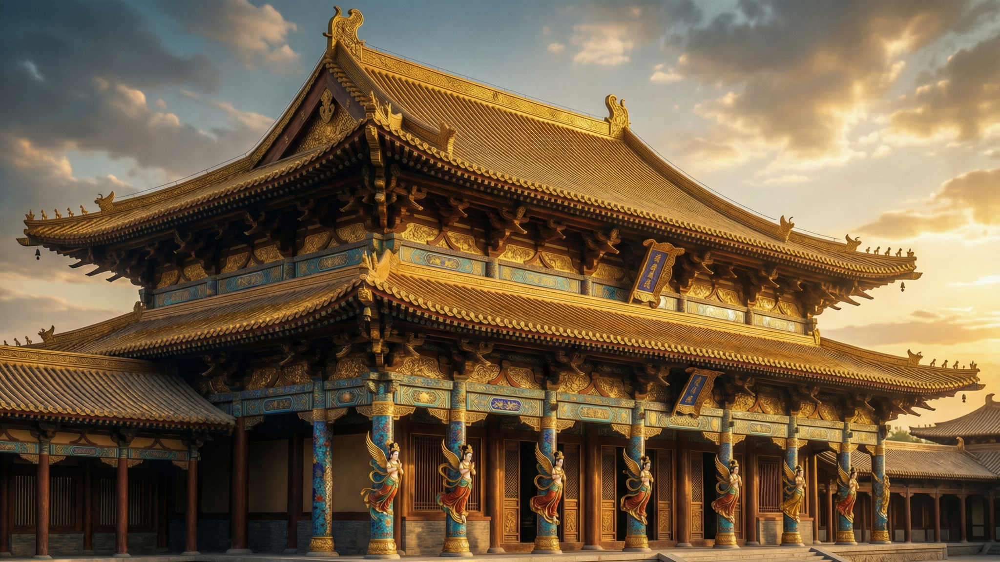
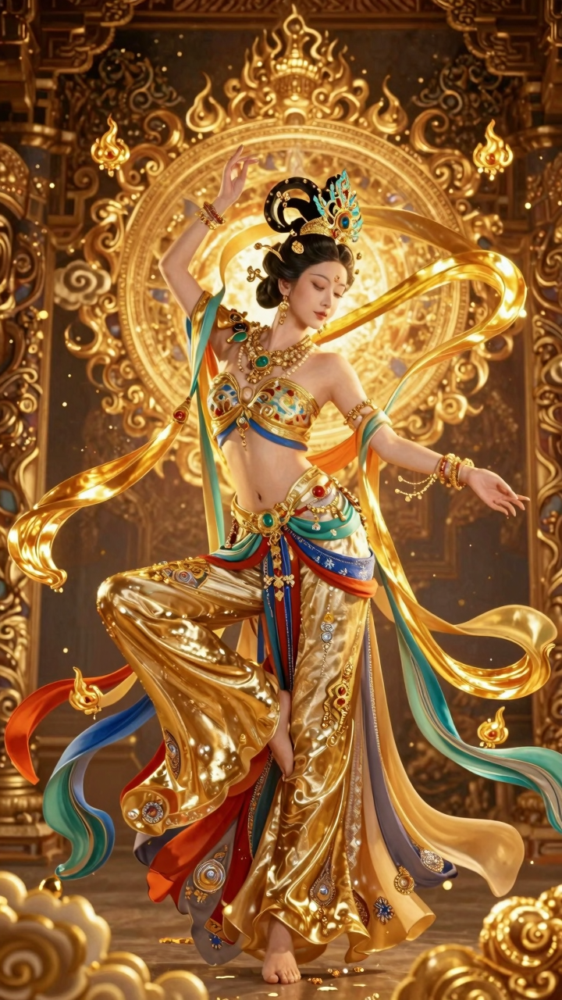
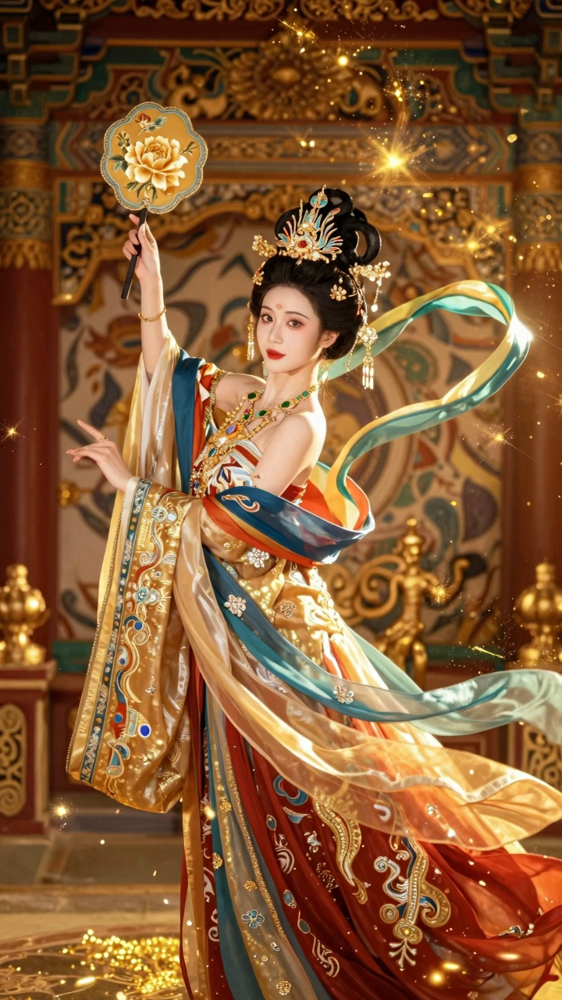

# 盛金敦煌风格 - Shengjin Dunhuang Style

融合中国传统艺术与西方华丽艺术的独特视觉风格。

## 风格定义

**盛金敦煌** = 盛唐雍容 + 金碧辉煌 + 敦煌飞天

核心特点：流光溢彩、极致华丽、金碧辉煌

## 色彩系统

- 鎏金 #D4AF37 (40%)
- 朱砂 #E74C3C (20%)
- 石绿 #2ECC71 (20%)
- 宝蓝 #3498DB (20%)
- 墨黑 #1A1A1A (5%)
- 珍珠白 #F5F5F5 (5%)

## 作品展示

### 宫殿建筑 | Palace Architecture

*2048x1152 | 3.8MB*

### 飞天人物 | Flying Apsaras

*720x1280 | 3.5MB*

### 宫廷美女 | Palace Beauty

*720x1280 | 1.4MB*

## 技术参数

- **模型**: Tongyi-MAI/Z-Image-Turbo (ModelScope)
- **质量**: normal
- **步数**: 8
- **引导**: 0

## 风格融合

- Tang Dynasty gold craftsmanship (唐代金银器工艺)
- Dunhuang flying apsars (敦煌飞天)
- Baroque theatricality (巴洛克戏剧性)
- Cloisonné enamel (景泰蓝掐丝)
- Rococo ornamental excess (洛可可繁复)

## 相关

- Skill 文档: `C:\Users\75451\.claude\skills\shengjin-dunhuang\SKILL.md`
- 灵感库: `D:\bgggcontent\灵感库\盛金敦煌风格-中国艺术x美第奇华丽融合.md`
